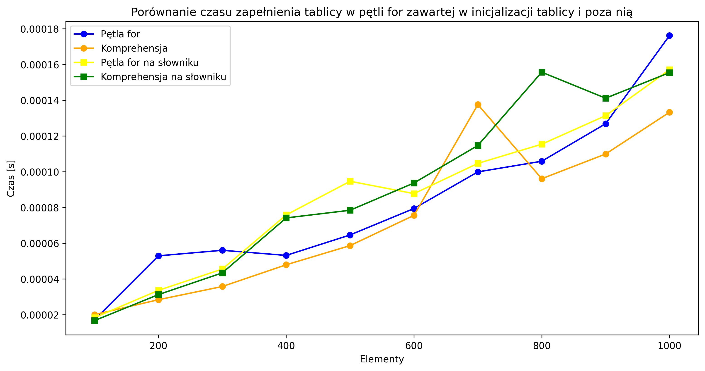

# Scenariusz
Testujemy dwa rodzaje funkcji zape³niaj¹ce s³owniki i listy potêgami kwadratowymi kolejnych iteracji zape³niania tablicy, przy spe³nieniu warunku. Program wykonuje ka¿d¹ z funkcji 10 razy, za ka¿dym razem zwiêkszaj¹c liczbê elementów o 100 pocz¹wszy od 100.
# Wyniki
 | D³ugoœæ tablicy / czas | Pêtla for | Komprehensja | Pêtla for na s³owniku | Komprehensja na s³owniku | 
 | --- | --- | --- | --- | --- |
 | 100 |  0.000017s | 0.000020s | 0.000018s | 0.000017s | 
 | 200 |  0.000053s | 0.000028s | 0.000034s | 0.000031s | 
 | 300 |  0.000056s | 0.000036s | 0.000046s | 0.000043s | 
 | 400 |  0.000053s | 0.000048s | 0.000076s | 0.000074s | 
 | 500 |  0.000065s | 0.000059s | 0.000095s | 0.000078s | 
 | 600 |  0.000079s | 0.000076s | 0.000088s | 0.000094s | 
 | 700 |  0.000100s | 0.000138s | 0.000105s | 0.000115s | 
 | 800 |  0.000106s | 0.000096s | 0.000115s | 0.000156s | 
 | 900 |  0.000127s | 0.000110s | 0.000131s | 0.000141s | 
 | 1000 |  0.000176s | 0.000133s | 0.000157s | 0.000155s | 

