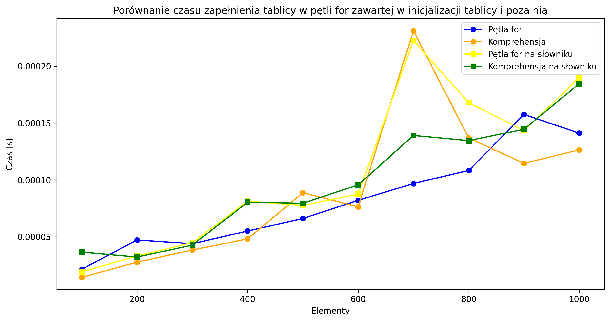

# Scenariusz
Testujemy dwa rodzaje funkcji zape³niaj¹ce s³owniki i listy potêgami kwadratowymi kolejnych iteracji zape³niania tablicy, przy spe³nieniu warunku. Program wykonuje ka¿d¹ z funkcji 10 razy, za ka¿dym razem zwiêkszaj¹c liczbê elementów o 100 pocz¹wszy od 100.
# Wyniki
 | D³ugoœæ tablicy / czas | Pêtla for | Komprehensja | Pêtla for na s³owniku | Komprehensja na s³owniku | 
 | --- | --- | --- | --- | --- |
 | 100 |  0.000021s | 0.000014s | 0.000019s | 0.000036s | 
 | 200 |  0.000047s | 0.000028s | 0.000033s | 0.000032s | 
 | 300 |  0.000044s | 0.000038s | 0.000045s | 0.000043s | 
 | 400 |  0.000055s | 0.000048s | 0.000081s | 0.000080s | 
 | 500 |  0.000066s | 0.000089s | 0.000077s | 0.000079s | 
 | 600 |  0.000082s | 0.000076s | 0.000087s | 0.000096s | 
 | 700 |  0.000097s | 0.000231s | 0.000222s | 0.000139s | 
 | 800 |  0.000108s | 0.000137s | 0.000168s | 0.000134s | 
 | 900 |  0.000157s | 0.000114s | 0.000143s | 0.000144s | 
 | 1000 |  0.000141s | 0.000126s | 0.000190s | 0.000185s | 

